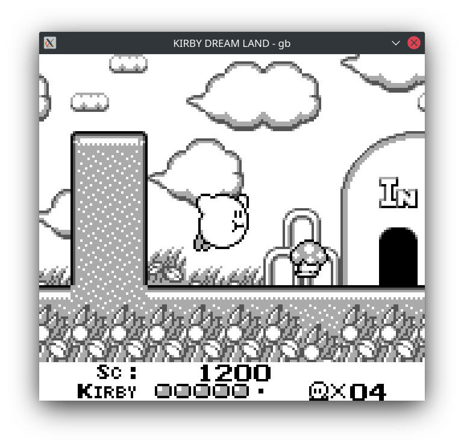
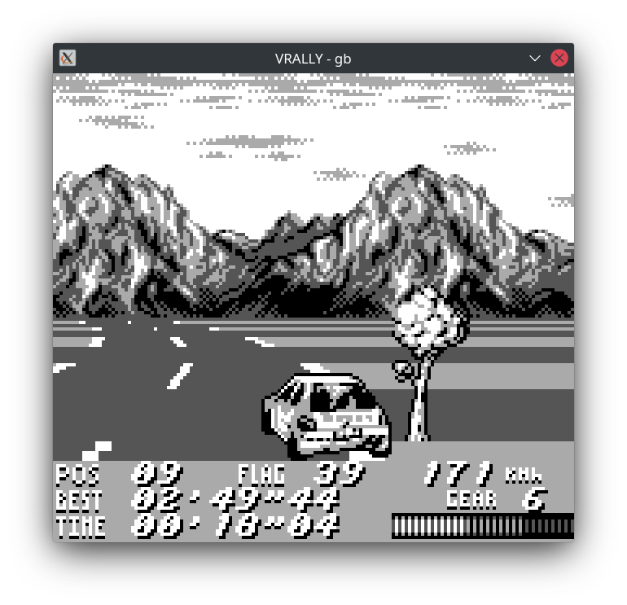
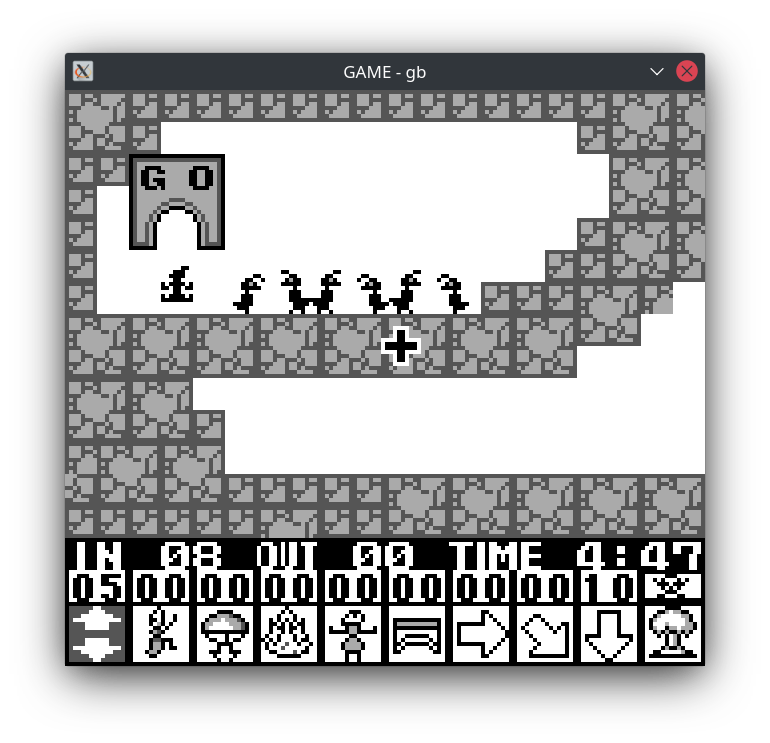
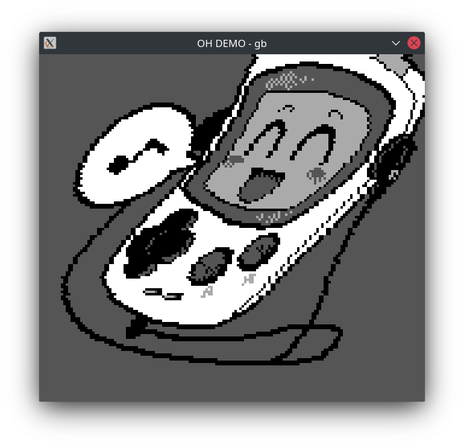
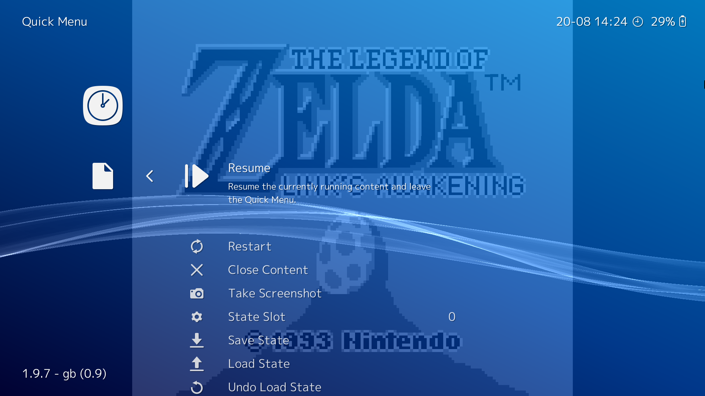

Yet another Gameboy emulator.

Implemented (at least I think so) features:
* Emulation of all CPU instructions
* Memory bus with RAM and redirection of MMIO requests to the peripherals
* MBC1, external cartridge RAM with save/load (battery emulation)
* Interrupts
* Timer
* Input
* Quite inaccurate, but full PPU implementation: background, window, sprites, OAM DMA
* Architecture - emulation core with abstract interface and frontends: SFML and libretro

The emulator passes Blargg's cpu_instr, instr_timing, mem_timing tests.

Tested software:
* Super Mario Land - looks playable
* Super Mario Land 2 - looks playable
* The Legend of Zelda: Link's Awakening - looks playable
* Kirby's Dream Land - looks playable
* Tetris - looks playable
* Dr. Mario - looks playable
* Bomb Jack - looks playable
* Ant Soldiers - looks playable
* V-Rally - looks playable
* Oh! Demo - looks as intended

* Road Rash - screen flickering during gameplay, but playable
* Kirby's Dream Land 2 - hangs
* Is That A Demo In Your Pocket? - some visual glitches

## Building

Supports both Clang and GCC.

Just `make` for SFML frontend. Requires CSFML (`sudo apt install libcsfml-dev` in Ubuntu and derivatives).

For libretro frontend, run `make -f Makefile.libretro` or `make -f Makefile.libretro-android`. For Android build, you must put correct Android NDK compiler path into the makefile.

## Running

* SFML frontend - as usual standalone application
* libretro frontend via Retroarch - move `gb_libretro.so` and `gb_libretro.info` to corresponding core and core info directories (`retroarch/cores` in case of Linux)

__Retroarch on Android moment__ - it's not possible to access the core directory as it's located in private app storage. On the other hand, Android security policies forbid dynamic loading of libraries from shared storage. Retroarch has option of manual core installing - but it ignores core info file and allows only BootROM to be run. However, core info directory can be located in shared storage. So, you must (1) install core using "Install or Restore Core" option, (2) put core info file in some folder in shared storage and (3) select this folder as core info directory.

##  Gallery

      
