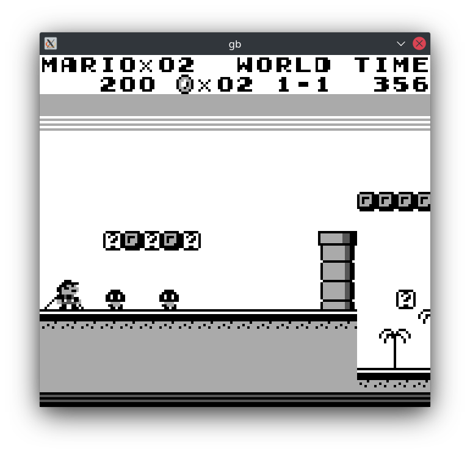
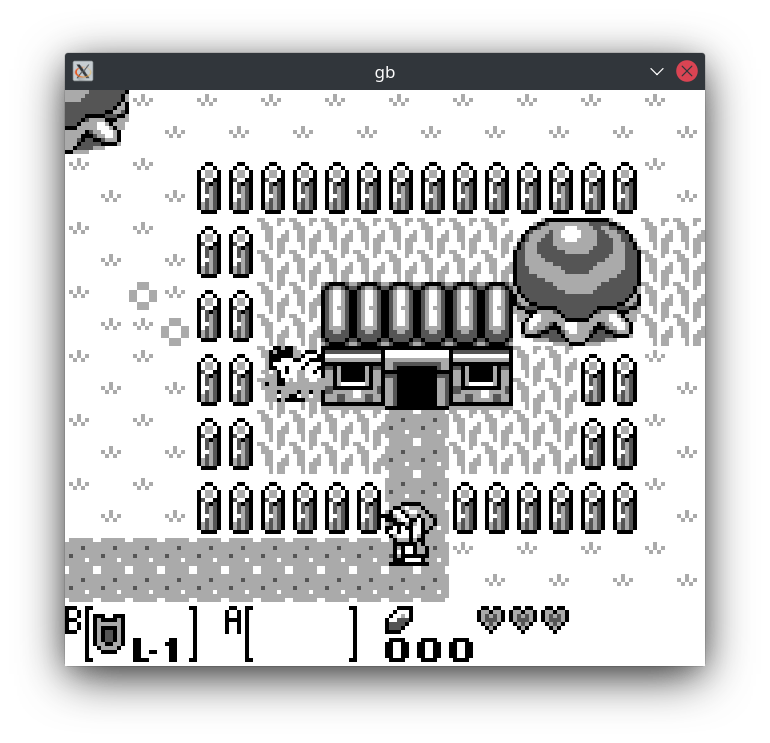

(Maybe in the future) Gameboy emulator.

Implemented (at least I think so) features:
* Emulation of all CPU instructions
* Memory bus with RAM and redirection of MMIO requests to the peripherals
* MBC1, external cartridge RAM with save/load (battery emulation)
* Interrupts
* Timer
* Input
* (Inaccurate and quite faulty) PPU implementation: background, window, sprites, OAM DMA

The emulator passes Blargg's cpu_instr, instr_timing, mem_timing tests.

Tested games:
* Super Mario Land - looks playable
* Super Mario Land 2 - looks playable
* The Legend of Zelda: Link's Awakening - looks playable
* Kirby's Dream Land - looks playable
* Tetris - looks playable
* Dr. Mario - looks playable
* Bomb Jack - looks playable
* Ant Soldiers - looks playable

## Building

Just `make`. Supports both Clang and GCC. Requires CSFML (`sudo apt install libcsfml-dev` in Ubuntu and derivatives)

##  Gallery

 
